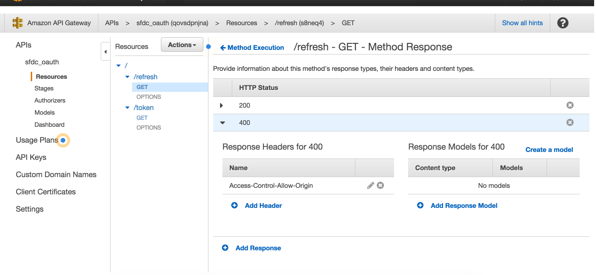
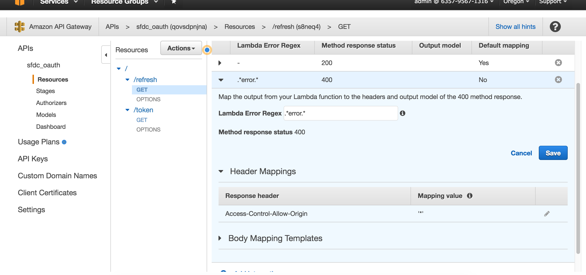

# tigermoms-lambda

### General Info
Controllers in `tigermom-koa` for each resource(e.g. `/user/*`, typically a table) will be organized as an independent lambda function stored in a folder with this name convention : `[Resource]Controller, e.g. UserController`

### Test Lambda Function Locally
* [lambda-local](https://github.com/ashiina/lambda-local)
```javascript
lambda-local -l index.js -h handler -e mock/event.js
```

### Role
* Created a customized policy called "TigerMoms"
```javascript
{
    "Version": "2012-10-17",
    "Statement": [
        {
            "Sid": "Stmt1466317859000",
            "Effect": "Allow",
            "Action": [
                "dynamodb:BatchGetItem",
                "dynamodb:BatchWriteItem",
                "dynamodb:DeleteItem",
                "dynamodb:GetItem",
                "dynamodb:PutItem",
                "dynamodb:Query",
                "dynamodb:Scan"
            ],
            "Resource": [
                "arn:aws:dynamodb:us-west-2:817031825439:table/User"
            ]
        }
    ]
}
```
* Created a Role called "TigerMomsRole", and attached above policy
* In Lambda function's Configuration panel, select "TigerMomsRole"

### AWS API GATEWAY

* Why JSON.stringify() result for context.fail()

If result.status is 'error', then use JSON.stringify, since in API GATEWAY we use regex(`.*error.*`) in Integration Response to find this response from 'errorMessage' (the default root for all response returned by context.fail()) and parse it, so it need to be a string; If result.status is not 'error', then directly return json object would be fine.
```
  if(result.status && result.status == 'error'){
    context.fail(JSON.stringify(result));
  }else{
    context.succeed(result);
  }
```
* CORS

API-Gateway allow us to enable CORS easily for resource/method via a button, however, that button only add `Access-Control-Allow-Origin` header for 200 response, in other words, your request (from browser) can only be successful if the status code is 200.

The solution is simple:

1. select a method, and in "Method Response", find the non-200 http status you created (e.g. 400), and click "Add Header", and add `Access-Control-Allow-Origin`;



2. go to "Integration Response", and choose the response you added (e.g. 400), and modify the "Mapping value" to "\*".




* Mapping request information to event object
  * [How to create a Request object for your Lambda event from API Gateway](http://kennbrodhagen.net/2015/12/06/how-to-create-a-request-object-for-your-lambda-event-from-api-gateway/)
  * For each method, go to `Integration Request/Body Mapping Templates/Add mapping template`, fill in `application/json`, and copy & paste the following to the blank text field. This will extract all request information `body, headers, method, path, params, query` and put them in the event object which lambda function has access to.

  ```javascript
  {
    "body" : $input.json('$'),
    "headers": {
      #foreach($header in $input.params().header.keySet())
      "$header": "$util.escapeJavaScript($input.params().header.get($header))" #if($foreach.hasNext),#end

      #end
    },
    "method": "$context.httpMethod",
    "path": "$context.resourcePath",
    "params": {
      #foreach($param in $input.params().path.keySet())
      "$param": "$util.escapeJavaScript($input.params().path.get($param))" #if($foreach.hasNext),#end

      #end
    },
    "query": {
      #foreach($queryParam in $input.params().querystring.keySet())
      "$queryParam": "$util.escapeJavaScript($input.params().querystring.get($queryParam))" #if($foreach.hasNext),#end

      #end
    }  
  }
  ```

* Mapping lambda function's returned value to final response (including error message)
  * [Error handling in AWS API Gateway with Lambda](https://medium.com/@pahud/error-handling-in-aws-api-gateway-with-lambda-28fb86b3ea1e#.ti6kotqcr)
  * For each method, go to `Method Response`, and add a response, e.g. 400; go to `Integration Response`, add an integration response, copy & paste the following content to `Lambda Error Regex` (this is because we stringified error message, which contains `status:error`)
  ```javascript
  .*status.*error.*
  ```
  * Finally click `Body Mapping Templates`, and copy & paste the following content to the text field. (*for every `context.fail([stringified error])` call, the stringified error will be put as a value for a key called errorMessage; that's why we use `$input.path("$.errorMessage")` to retrieve the entire stringified error, convert it back to json (.path), assign it to `$inputRoot`, and return it)*)

  ```javascript
  #set($inputRoot = $input.path("$.errorMessage"))
  $inputRoot
  ```
